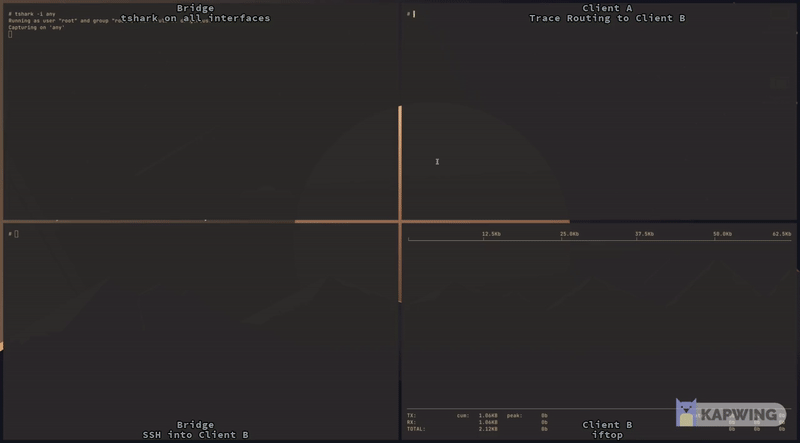

# Docker Playground


[](https://github.com/MrWelsch/dpg)
[](http://makeapullrequest.com)




# Table of contents

- [What’s included?](#whats-included)
  * [Basic Routing](#basic-routing)
  * [BGP](#bgp)
  * [FTP](#ftp)
  * [SSH](#ssh)
  * [Monitoring](#monitoring)
- [Project Goals](#project-goals)
- [Install In One Command!](#install-in-one-command)
  * [Get the latest version of Docker](#get-the-latest-version-of-docker)
- [Getting started](#getting-started)
  * [Connect to a Container](#home-screen)
  * [Establish a SSH Connection](#establish-a-ssh-connection)
  * [Check your IP Adress](#check-your-ip-adress)
- [Configuration](#configuration)
  * [IP Adress](#an-example-installation-of-the-colorizer-plugin)
  * [Routing](#finding-plugins)
  * [User Name](#user-name)

# What’s included?

DPG provides an expandable networking sanbox in which the user can practice
basic routing.

## Basic Routing
Packages can be routed from one client to another over a bridge.

## BGP

## FTP

## SSH
The user is given the ability to connect to any container from inside a
container via SSH.

## Monitoring
Various monitoring tools are installed on each container </br>
e.g. 
- tshark
- iftop
- ...

# Project Goals
The goal of this project is to create a network environment via docker which
enables students to practice basic networking. To achieve this the network
should have the following traits:
- Scalability
- Static Ip Adresses
- User friendlyness

# Install In One Command!
```sh
git clone https://github.com/MrWelsch/dpg
```

## Get The Latest Version Of Docker
### MacOS
Use [Homebrew Cask](https://brew.sh) to download the app by running these commands:
```sh
brew update
brew install --cask docker
```
### Linux
#### Debian Based
The [Main
Repository](https://debian.pkgs.org/11/debian-main-amd64/docker_1.5-2_all.deb.html)
of debian provides the [Docker](https://www.docker.com) package.
```sh
apt-get update
apt-get install docker
```
#### Arch Based
[Docker](https://www.docker.com) is available via the [community
repository](https://archlinux.org/packages/community/x86_64/docker/) and can be
iinstalled as instructed below:
```sh
sudo pacman -Syu
sudo pacman -S docker
```
### Windows
#### Chocolatey
The app can be installed via [Chocolatey](https://chocolatey.org) by using the
[Docker Package](https://community.chocolatey.org/packages/docker-desktop).
```sh
choco upgrade
choco install docker-desktop
```

# Getting Started
To use the docker Playground you need to be in the source directory.<br/>
Inside that directory execute the following command:
```sh
docker compose up --build --remove-orphans -d
```
This will build the configured networks and services as well as run them.<br/>
To shut down the previously built playground execute:
```sh
docker compose down
```
## Basic Commands
| Description       | Command                                                                   |
|:-----------------:|:-------------------------------------------------------------------------:|
| Show Containers   | docker compose ps                                                         |
| Show Networks     | docker network ls                                                         |
| Show Logs         | docker compose logs                                                       |
| Enter a Container | docker exec -it <span style="color:cyan">container_name</span> /bin/sh    |

## Establish A SSH Connection
To establish a ssh connection to another container use:
```sh
ssh user_name@ip_adress
```
e.g.
```sh
ssh client@10.2.0.2
```

## Check Your IP Adress
The IP Adress of each Network Interface can be inspected by using:
```sh
ip a
```

# Configuration
All configuration is done inside the `docker-compose.yml` file. </br>
The user can set various environment variables which are needed to configure the
network.

## IP Adress
The IP Adress of each container can be set as follows:
```yml
environment:
  IP_ADRESS: 10.1.0.2/16
```
## Routing
To configure a route one has to define the destinated network as well as an IP
Adress to be routed over. The corresponding environment variable has to be named
after the convention `ROUTING_routename`.
```yml
environment:
  ROUTING_A: 10.1.0.3/16,10.2.0.0/16
````
## User Name
The user is enabled to create a user with a password. If no password is chosen
it will default to `playground`. </br> </br>
If the environment variable `USER_NAME` is not set the default user `client` or
`bridge` depending on the container type will be created with the before
mentioned default password. 
```yml
environment:
  USER_NAME: example
  USER_PASSWORD: dummy
```

### Example Configuration File
```yml
version: '3'
services:
    s10:
        container_name: container_a
        build:
            context: ./client
            dockerfile: Dockerfile
        environment:
            IP_CONTAINER: 10.1.0.2/16
            ROUTING_A: 10.1.0.3/16,10.2.0.0/16
            USER_NAME: client
            USER_PASSWORD: playground
        stdin_open: true
        cap_add:
            - NET_ADMIN
        networks:
            - network_a
        ports:
            - 1010:22
        restart: on-failure
    s20:
        container_name: bridge
        build:
            context: ./bridge
            dockerfile: Dockerfile
        environment:
            BRIDGE_IP_NETWORK_A: 10.1.0.3/16
            BRIDGE_IP_NETWORK_B: 10.2.0.3/16
        stdin_open: true
        cap_add:
            - NET_ADMIN
        networks:
            - network_a
            - network_b
        restart: on-failure
    s30:
        container_name: container_b
        build:
            context: ./client
            dockerfile: Dockerfile
        environment:
            IP_CONTAINER: 10.2.0.2/16
            ROUTING_A: 10.2.0.3/16,10.1.0.0/16
            USER_NAME: client
            USER_PASSWORD: playground
        stdin_open: true
        cap_add:
            - NET_ADMIN
        networks:
            - network_b
        ports:
            - 2020:22
        restart: on-failure

networks:
    network_a:
        driver: bridge

    network_b:
        driver: bridge
```
